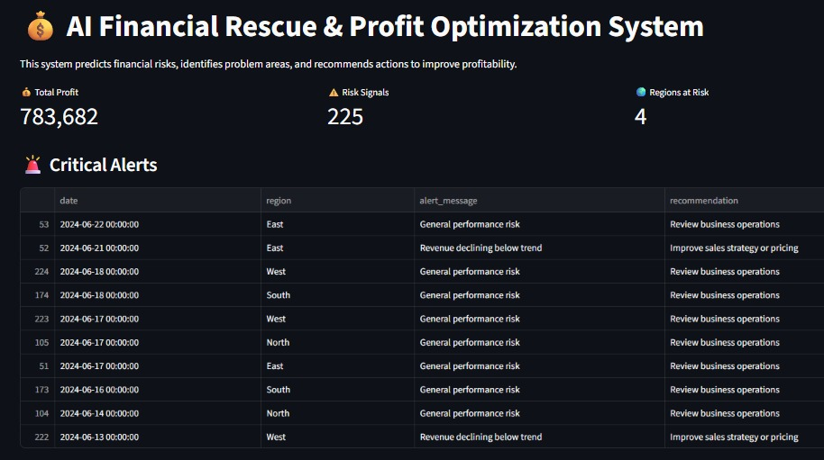
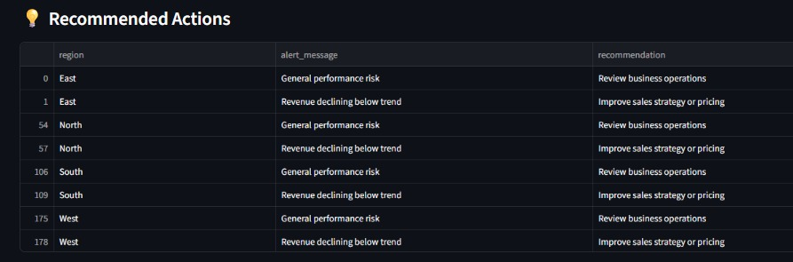
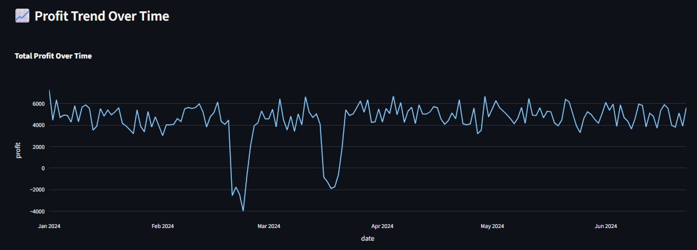
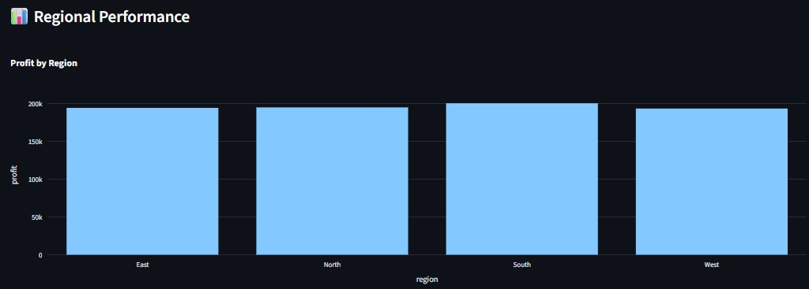

# AI Financial Rescue & Profit Optimization System

This project started from a simple question:

> What if a company could detect financial problems before they become serious?

Instead of building just another dashboard, I wanted to create a system that could:
- monitor business performance,
- identify risky patterns,
- predict possible profit decline,
- and suggest actions that could help improve performance.

The result is this AI-driven financial monitoring system.

It combines data engineering, KPI analysis, machine learning, and dashboarding into one workflow.

---

## Dashboard Preview






---

# What the System Does

The system simulates financial activity across multiple business regions and tracks how performance changes over time.

It monitors things like:
- revenue,
- operational cost,
- orders,
- customer activity,
- and marketing spend.

Using this information, the system:
- calculates business KPIs,
- detects unhealthy trends,
- predicts future financial risk,
- and generates recommendations for decision-making.

---

# Why I Built This

A lot of data projects stop at visualization.

I wanted to go a step further and focus on:
- decision support,
- operational monitoring,
- and predictive insight.

The goal was to build something closer to how real business systems work:
raw data → processing → prediction → action.

---

# How the Project Works

The workflow follows a layered pipeline structure.

## 1. Data Generation
Synthetic business data is generated to simulate realistic operational behavior, including:
- rising costs,
- declining demand,
- inefficient marketing spend,
- and unstable profit trends.

---

## 2. Data Storage
The raw data is stored in SQLite for structured processing.

---

## 3. Feature Engineering
Business metrics are calculated from the raw data, including:
- profit,
- conversion rate,
- cost per order,
- marketing efficiency,
- rolling revenue averages.

These features are later used for analysis and prediction.

---

## 4. Machine Learning Prediction
A Random Forest model is trained to identify whether a region is likely to experience future profit decline.

The prediction is based on historical operational patterns and KPI behavior.

---

## 5. Alert & Recommendation Engine
When risk is detected, the system generates alerts and business recommendations such as:
- reducing operational costs,
- improving sales strategy,
- optimizing marketing campaigns,
- or reviewing conversion performance.

---

## 6. Dashboard Visualization
All outputs are displayed through an interactive Streamlit dashboard for easier monitoring and decision-making.

---

# 🛠 Tech Stack

- Python
- Pandas
- SQLite
- Scikit-learn
- Streamlit
- Plotly

---

# Project Structure

```text
ai-financial-rescue-system/
│── app.py
│── requirements.txt
│── README.md
│
├── data/
│   └── financial_data.csv
│
├── images/
│   └── dashboard.png
│
├── src/
│   ├── generate_financial_data.py
│   ├── db_setup_financial.py
│   ├── load_financial_data.py
│   ├── transform_financial_data.py
│   ├── train_model.py
│   └── generate_alerts.py
```

---

# Running the Project

## Install dependencies

```bash
pip install -r requirements.txt
```

---

## Run the pipeline

```bash
python src/db_setup_financial.py
python src/generate_financial_data.py
python src/load_financial_data.py
python src/transform_financial_data.py
python src/train_model.py
python src/generate_alerts.py
```

---

## Launch the dashboard

```bash
python -m streamlit run app.py
```

---

# Example Questions This System Can Answer

- Which regions are becoming financially unstable?
- Are operational costs growing too quickly?
- Is marketing spend producing enough value?
- Which business areas require immediate attention?

---

# Future Improvements

Some areas I would improve next:
- real-time API ingestion,
- cloud database integration,
- Airflow orchestration,
- automated notifications,
- and more advanced forecasting models.


---

## Author

**Joshua OBIKUNLE**